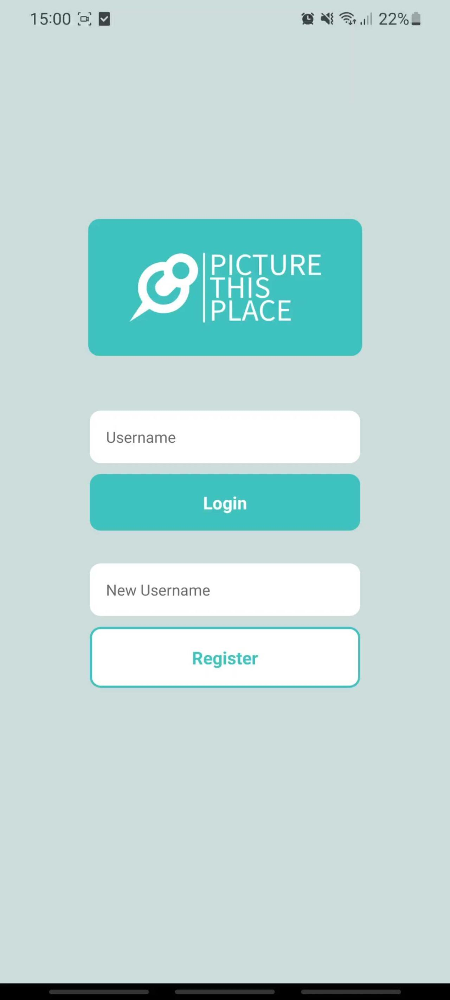
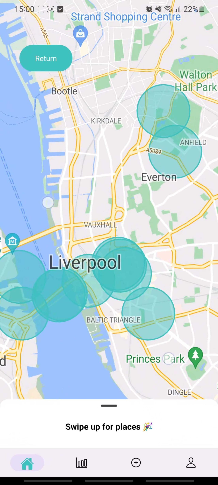
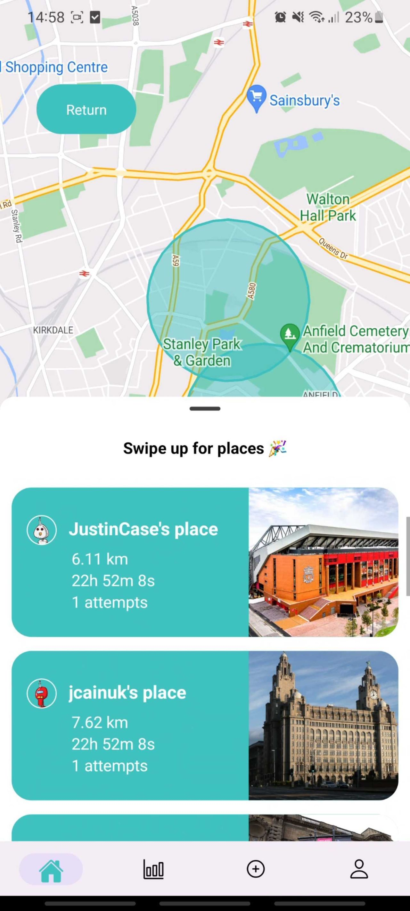
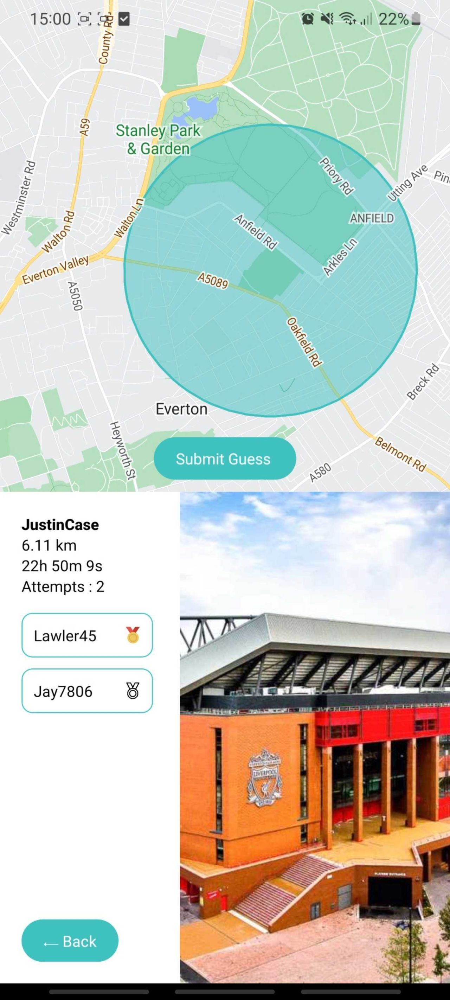
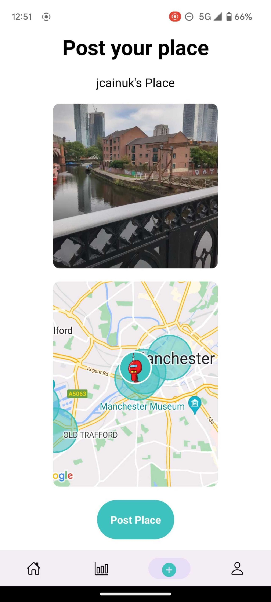
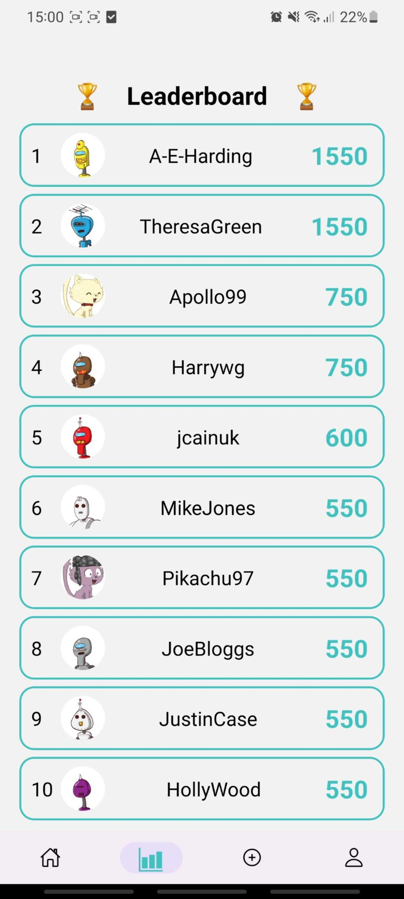

# Picture-This-Place Mobile App (Front-End)

Welcome to the front-end repo for `Picture-This-Place`, a mobile app that encourages local exploration, social engagement, and gameplay by allowing users to submit photos of places, while other users guess the location in the photo by walking to that place and submitting a guess using their own phone coordinates. Users earn points and medals for correct guesses and compete on leaderboards.

## Link to Picture-This-Place API (Back-End)

For the back-end we used Express, Node, MongoDB and Mongoose.

Please find more information about our back-end API by visiting the repo for it here:
<a href="https://github.com/jcainuk/group-5-backend" target="_blank">Back-End GitHub repo</a>

# The Team

We are a team of five enthusiastic software engineers, and we developed `Picture-This-Place` as our final project during the `July 2023` cohort of <a href="https://northcoders.com/" target="_blank">Northcoders</a>, a software engineering bootcamp that enables career-changers to become developers in 13 weeks.

- <a href="https://github.com/Jay7806" target="_blank">James Smith</a>
- <a href="https://github.com/Harrywg" target="_blank">Harry Ward-Gray</a>
- <a href="https://github.com/Lawler45" target="_blank">Lewis Lawler</a>
- <a href="https://github.com/A-E-Harding" target="_blank">Alice Harding</a>
- <a href="https://github.com/jcainuk" target="_blank">Jonathan Cain</a>

# Table of Contents

- [Live Demo](#live-demo)
- [Screenshots](#screenshots)
- [Technologies Used](#technologies-used)
- [Project Description](#project-description)
- [Features](#features)
- [Components Overview](#components-overview)
  - [App](#app)
  - [api](#api)
  - [HomePage](#homepage)
  - [LeaderBoard](#leaderboard)
  - [ListedSinglePlace](#listedsingleplace)
  - [Login](#login)
  - [Logo](#logo)
  - [Map](#map)
  - [Post](#post)
  - [Profile](#profile)
  - [SinglePlace](#singleplace)
  - [SubmittedGuess](#submittedguess)
- [Detailed Component Documentation](#detailed-component-documentation)
- [Reflections and Key Learnings](#reflections-and-key-learnings)
  - [Backend Challenges and Insights](#backend-challenges-and-insights)
  - [Frontend Challenges and Insights](#frontend-challenges-and-insights)
  - [Working Together (Ways of Working)](#working-together-ways-of-working)
  - [Technological Transition](#technological-transition)
  - [React Native Styling](#react-native-styling)
- [Setup Instructions](#setup-instructions)
  - [Prerequisites](#prerequisites)
  - [Fork and Clone the Repository](#fork-and-clone-the-repository)
  - [Install Dependencies](#install-dependencies)
  - [Scripts](#scripts)
- [Future Considerations](#future-considerations)
- [Team Members](#team-members)

# Live Demo

[Back to the Top](#table-of-contents)

Please find a demonstration video of the full project here:
<a href="https://www.youtube.com/watch?v=CL6b3KgObPg" target="_blank">Demo Video</a>

# Screenshots

[Back to the Top](#table-of-contents)

<div align="center">
  
  
  
</div>

<div align="center">
  
  
  
</div>

# Technologies Used

[Back to the Top](#table-of-contents)

List of technologies and libraries used in our project's front-end.

- **React**: A JavaScript library for building user interfaces.
- **React Native**: A framework for building native mobile applications using React.
- **Expo**: A platform for building and deploying React Native applications.
- **axios**: A JavaScript library used for making HTTP requests to APIs.
- **@gorhom/bottom-sheet**: A library for creating customizable bottom sheets in React Native.
- **@react-navigation/native**: A navigation library for React Native applications.
- **@react-navigation/native-stack**: A stack navigator for React Navigation.
- **@react-navigation/material-bottom-tabs**: A tab navigator for React Navigation with a material design style.
- **@react-navigation/material-top-tabs**: A top tab navigator for React Navigation with a material design style.
- **expo-camera**: A library for working with the device's camera in Expo applications.
- **expo-location**: A library for working with device location services in Expo applications.
- **expo-media-library**: A library for accessing media files on the device in Expo applications.
- **expo-status-bar**: A library for managing the status bar in Expo applications.
- **react-native-gesture-handler**: A library for handling gestures in React Native applications.
- **react-native-keyboard-aware-scroll-view**: A library for creating scrollable views that automatically adjust for the keyboard in React Native.
- **react-native-maps**: A library for integrating maps into React Native applications.
- **react-native-pager-view**: A library for creating paged views in React Native.
- **react-native-paper**: A UI library for React Native applications.
- **react-native-reanimated**: A library for creating smooth and interactive animations in React Native.
- **react-native-safe-area-context**: A library for handling safe areas in React Native applications.
- **react-native-screens**: A library for managing screens and navigation in React Native.
- **react-native-swipe-up-down**: A library for adding swipe up and down gestures to React Native components.
- **react-native-tab-view**: A library for creating tabbed interfaces in React Native.
- **react-native-vector-icons**: A library for using vector icons in React Native applications.
- **vector-icons**: A library for including vector icons in our React Native project.

# Project Description

[Back to the Top](#table-of-contents)

`Picture-This-Place` is a React-Native mobile app that promotes local exploration, social engagement, and fun gameplay. Users can create accounts, submit photos of places, and challenge others to guess the location. Points are awarded for correct guesses, and users can compete on leaderboards. It's an interactive way to encourage people to get out of the house, explore their surroundings, and connect with others in their local area.

# Features

[Back to the Top](#table-of-contents)

#### Explore Places

- As a user, I can view a list of places on the home page.
  I can click on a place to view more details, including its location on the map.

#### Submit New Places

- As a user, I can use the "Post" feature to capture images of interesting places.
  I can provide a name and location for the place I'm submitting.

#### View Leaderboard

- As a user, I can access the "Leaderboard" to see how my achievements compare to others.
- I can view rankings based on total achievement points from gold, silver, and bronze medals.

#### User Authentication

- As a user, I can log in to my account using my credentials.
- I can also create a new account if I don't have one.

#### Manage User Profile

- As a user, I can access my profile to view my details.
- I can see my achievements, including gold, silver, and bronze medals.

#### View Single Place Details

- As a user, I can click on a place to view detailed information.
- I can see the creator of the place, its distance from my current location, and time left before the event expires.

#### Submit Guesses

- As a user, I can submit my guess coordinates from my phone when near a specific place.
- I receive feedback on my guess, including bronze, silver, or gold medals.

#### Interactive Map

- As a user, I can use the map to explore places visually.
- I can view markers on the map that represent different places.

#### Real-time Updates

- As a user, I receive real-time updates on the leaderboard and place details.
- I can see changes in rankings and event statuses as they occur.

# Components Overview

[Back to the Top](#table-of-contents)

Here's an overview of the key components in this project:

### From Components Folder:

1. **HomePage.js**

   - **Purpose**: Displays the main landing page of the application.
   - **Functionality**: Provides an interface to explore places, submit new locations, and view user details.
   - **Usage**: This component serves as the starting point for users when they open the app.

2. **LeaderBoard.js**

   - **Purpose**: Displays a leaderboard of users based on their achievements.
   - **Functionality**: Allows users to view rankings and achievements of other users.
   - **Usage**: Accessed to see the leaderboard within the app.

3. **ListedSinglePlace.js**

   - **Purpose**: Lists information about a single place.
   - **Functionality**: Displays basic place details, including the name and location.
   - **Usage**: Integrated into various parts of the app for displaying place information.

4. **Login.js**

   - **Purpose**: Provides user authentication and login functionality.
   - **Functionality**: Users can log in with their credentials or create a new account.
   - **Usage**: Accessed when users need to log in or sign up.

5. **Logo.js**

   - **Purpose**: Renders the project's logo or title.
   - **Functionality**: Displays the project's name or logo in the UI.
   - **Usage**: Typically used for branding and identification.

6. **Map.js**

   - **Purpose**: Renders an interactive map view within the application.
   - **Functionality**: Allows users to view places on the map, track their current location, and interact with location-related features.
   - **Usage**: This component is integrated into various parts of the application for map visualization.

7. **Post.js**

   - **Purpose**: Allows users to post new places.
   - **Functionality**: Captures images using the device's camera, records location data, and allows users to submit new places.
   - **Usage**: Users can access this component to contribute new locations to the app.

8. **Profile.js**

   - **Purpose**: Displays user profiles and account-related options.
   - **Functionality**: Shows user details, achievements, and provides options for logging out and deleting the account.
   - **Usage**: Users can access this component to manage their profiles and account settings.

9. **SinglePlace.js**

   - **Purpose**: Displays detailed information about a single place.
   - **Functionality**: Shows place details, user guesses, and allows users to submit their own guesses.
   - **Usage**: Accessed when users want to view or interact with a specific place.

10. **SubmittedPlace.js**
    - **Purpose**: Handles the submission and display of user-submitted places.
    - **Functionality**: Allows users to view details of their submitted places.
    - **Usage**: Accessed after submitting a new place.

### From Parent Folder:

11. **App.js**

    - **Purpose**: The root component of the application.
    - **Functionality**: Manages navigation and the overall structure of the app.
    - **Usage**: The main entry point of the application.

12. **api.js**
    - **Purpose**: Contains functions for making API requests.
    - **Functionality**: Provides communication with the server to fetch and send data.
    - **Usage**: Used throughout the app to interact with the backend.

# Detailed Component Documentation

[Back to the Top](#table-of-contents)

## App

[Back to the Top](#table-of-contents)

The `App.js` component is the entry point of the mobile application. It sets up the navigation structure, including tabs and screens for the app.

#### Functionality

- Initializes the `AuthProvider` to provide authentication context to the entire app.
- Configures the navigation structure using `react-navigation` and defines the main pages.
- Implements a bottom tab navigation bar with icons for the Home Page, Leaderboard, Post Place, and Profile.
- Uses [Ionicons](https://ionic.io/ionicons) for tab icons.
- Provides screen options to customize tab icons and labels.
- Wraps the entire app in `GestureHandlerRootView` to enable gesture handling.

#### Usage

The `App` component is the root component of the application and is typically not imported or used elsewhere in the codebase. It serves as the starting point of the app, defining the navigation structure and providing the authentication context.

## api

[Back to the Top](#table-of-contents)

#### Description

`api.js` contains functions for making HTTP requests to the backend server of our mobile application. It uses the Axios library to simplify network requests and manage the base URL for the API.

#### Functions

1. **getUsers()**

   - Description: Retrieves a list of users from the backend.
   - Usage: Call `getUsers()` to fetch user data.

2. **getPlaces()**

   - Description: Retrieves a list of places from the backend.
   - Usage: Call `getPlaces()` to fetch place data.

3. **getOrderedPlaces(lat, lon)**

   - Description: Retrieves a list of places ordered by proximity to the given latitude and longitude.
   - Parameters:
     - `lat` (number): Latitude coordinate.
     - `lon` (number): Longitude coordinate.
   - Usage: Call `getOrderedPlaces(lat, lon)` to fetch ordered place data.

4. **getUsersByUsername(username)**

   - Description: Retrieves user data by their username.
   - Parameters:
     - `username` (string): Username of the user.
   - Usage: Call `getUsersByUsername(username)` to fetch user data by username.

5. **postUsers(userData)**

   - Description: Creates a new user with the provided user data.
   - Parameters:
     - `userData` (object): User data to be created.
   - Usage: Call `postUsers(userData)` to create a new user.

6. **postPlace(newPlace)**

   - Description: Creates a new place with the provided place data.
   - Parameters:
     - `newPlace` (object): Place data to be created.
   - Usage: Call `postPlace(newPlace)` to create a new place.

7. **updateUsers(userId, userData)**

   - Description: Updates an existing user's data.
   - Parameters:
     - `userId` (string): ID of the user to be updated.
     - `userData` (object): Updated user data.
   - Usage: Call `updateUsers(userId, userData)` to update a user's data.

8. **deleteUser(userId)**

   - Description: Deletes an existing user.
   - Parameters:
     - `userId` (string): ID of the user to be deleted.
   - Usage: Call `deleteUser(userId)` to delete a user.

9. **postGuess(id, guess)**
   - Description: Posts a user's guess for a specific place.
   - Parameters:
     - `id` (string): ID of the place where the guess is posted.
     - `guess` (object): User's guess data.
   - Usage: Call `postGuess(id, guess)` to post a guess.

#### Note

Ensure that you have a valid backend server URL in the `baseURL` field of the `api.js` file before making API requests.

## HomePage

[Back to the Top](#table-of-contents)

### Description

The `HomePage.js` component is the main screen of the mobile application. It displays a map showing nearby places and a list of these places in a bottom sheet. Users can interact with the map and access detailed information about each place.

### Functionality

- Displays a map with the user's current location and nearby places.
- Retrieves and displays a list of places ordered by proximity.
- Allows users to swipe up to view the list of places.
- Calculates and displays the distance and countdown to each place.
- Provides a way to navigate to the details of a selected place.

### Usage

The component is used as the initial screen of the mobile application.

### Dependencies

- `@gorhom/bottom-sheet`: Used to implement the bottom sheet functionality.
- `react-native-gesture-handler`: Used for gesture handling.
- `Map.js`: A child component that displays the map.
- `ListedSinglePlace.js`: A child component used to render individual places in the list.

### Props

- None

### Important Functions

1. **calculateDistance(lat1, lon1, lat2, lon2)**

   - Description: Calculates the distance between two sets of latitude and longitude coordinates using the Haversine formula.
   - Usage: Used to determine the distance between the user's current location and each place.

2. **calculateCountdown(place)**

   - Description: Calculates the countdown timer for each place based on its creation time.
   - Usage: Used to display the remaining time until the event associated with each place ends.

3. **goToSinglePlace(selectedPlace, currentLocation)**
   - Description: Navigates to the details page of a selected place.
   - Parameters:
     - `selectedPlace` (object): The place to navigate to.
     - `currentLocation` (object): The current location of the user.
   - Usage: Triggered when a user selects a place from the list.

### Styling

The component uses various styles defined in the `styles` object to control the appearance of elements, including text, images, and the bottom sheet.

### Note

Ensure that the necessary dependencies are installed and configured for this component to work correctly. The component relies on the Axios library for making API requests, which should be set up in `api.js`.

## LeaderBoard

[Back to the Top](#table-of-contents)

### Description

The `LeaderBoard.js` component displays the leaderboard of users based on their achievements and points. It ranks users by their points, considering different achievement levels (bronze, silver, and gold).

### Functionality

- Fetches a list of users and their achievements from the API.
- Calculates each user's total points based on their achievements.
- Sorts users by points and displays the top 10 users in the leaderboard.
- Displays each user's avatar, username, and total points.

### Usage

The component is used to present the leaderboard screen within the mobile application.

### Dependencies

- `@react-navigation/native`: Used for navigation within the application.
- `api.js`: A module for making API requests to fetch user data.
- `react-native`: Core library for building mobile UI components.
- `StyleSheet` from `react-native`: Used for defining component styles.

### Props

- None

### Important Functions

1. **useEffect**

   - Description: Fetches the list of users and their achievements when the component mounts.
   - Usage: Initializes the `users` state with data from the API.

2. **usersWithPoints.map(user)**
   - Description: Calculates the total points for each user based on their achievements (bronze, silver, gold).
   - Usage: Computes the `points` property for each user object.

### Styling

The component uses various styles defined in the `styles` object to control the appearance of elements, including text, images, and the leaderboard layout.

### Note

Ensure that the API endpoint for fetching user data is correctly configured in `api.js` for this component to work. The calculated points for each user are determined by the formula:

- points = (bronze \* 25) + (silver \* 50) + (gold \* 100)

## ListedSinglePlace

[Back to the Top](#table-of-contents)

### Description

The `ListedSinglePlace.js` component represents a single place in a list view, typically used in the homepage. It displays information about a place, including its name, countdown timer, distance from the user's current location, and an image.

### Functionality

- Calculates and displays the countdown timer for an event.
- Computes and displays the distance between the user's current location and the place.
- Allows the user to select a place to view more details.

### Usage

The component is used within the homepage to present a list of places with event details.

### Props

- `place`: An object containing information about the place, including its name, countdown, coordinates, and image URL.
- `styles`: A set of styles for formatting the component's appearance.
- `calculateDistance`: A function for calculating the distance between two sets of coordinates.
- `currentLocation`: An object representing the user's current location with latitude and longitude.
- `calculateCountdown`: A function for calculating and formatting the event countdown.
- `goToSinglePlace`: A callback function for navigating to a detailed view of the selected place.

### Important Functions

1. **useEffect**
   - Description: Initializes a timer to update the countdown display every second.
   - Usage: Keeps the countdown timer up to date.

### Styling

The appearance of the component is controlled by the styles provided through the `styles` prop.

### Note

The component relies on the `calculateDistance` and `calculateCountdown` functions to determine distance and countdown values. Ensure these functions are correctly implemented and provided as props when using the component.

## Login

[Back to the Top](#table-of-contents)

### Description

The `Login.js` component provides a user login and registration interface for the application. It allows users to enter their username for login or choose a new username for registration.

### Functionality

- Users can input their username to log in.
- Users can choose a new username to register.
- Validation is performed to check if the chosen username already exists during registration.
- Users can trigger login or registration actions.
- Loading indicators are displayed during login and registration processes.

### Usage

The component is typically used in the initial phase of the application to authenticate users or register new users.

### Props

None.

### Important Functions

1. **handleLogin**

   - Description: Initiates the login process by checking if the entered username exists and navigating to the main pages if successful.
   - Usage: Triggered when the "Login" button is pressed.

2. **handleRegister**
   - Description: Initiates the registration process by checking if the chosen username already exists, then registering the user and navigating to the main pages if successful.
   - Usage: Triggered when the "Register" button is pressed.

### Styling

- The appearance of the component is controlled by various styles defined in the `styles` object.
- Different styles are applied to input fields and buttons based on loading states and validation.

### Note

- This component depends on the `useAuth` context for user authentication and navigation actions to move to the main application pages.
- Ensure that proper error handling is in place for failed login and registration attempts.

## Logo

[Back to the Top](#table-of-contents)

### Description

The `Logo.js` component is a simple component responsible for displaying the logo or application name. It serves as a visual representation of the application.

### Functionality

- The component renders the text "Picture this place," which represents the application's name or logo.

### Usage

The `Logo` component can be used in various parts of the application's user interface where you want to display the application's name or logo.

### Props

None.

### Important Functions

None.

### Styling

- The appearance of the component can be customized by applying styles directly to the `Text` component.

### Note

- This component is primarily a static element and doesn't contain interactive logic or dynamic content.

## Map

[Back to the Top](#table-of-contents)

### Description

The `Map.js` component is responsible for rendering a map view and handling location-related functionality within the application. It displays a map with user and place markers and allows the user to interact with the map.

### Functionality

- Displays a map using the `MapView` component from `react-native-maps`.
- Fetches and displays place markers on the map.
- Monitors the user's current location and updates the map accordingly.
- Provides a button to return to the user's current location on the map.
- Allows the user to interact with the map, including scrolling and zooming.
- Displays circles representing places and the user's current location on the map.

### Usage

The `Map` component is typically used within the application to provide a visual representation of places and the user's current location.

### Props

- `specificLocation`: Specifies a specific location to center the map on (optional).
- `currentLocation`: Represents the user's current location.
- `setCurrentLocation`: Function to update the current location.
- `onPositionChange`: Function to handle position changes.
- `mapRef`: Ref for the map component.
- `placeCoords`: Coordinates of a selected place (optional).
- `calculateDistance`: Function to calculate the distance between two sets of coordinates.
- `selectedPlace`: Represents the selected place (optional).

### Important Functions

- `handleRegionChangeComplete(region)`: Handles map region changes and checks if the user has scrolled away from their current location.
- `returnToCurrentLocation()`: Returns the map to the user's current location when the "Return" button is pressed.

### Styling

- The appearance of the component can be customized by applying styles directly to various components within the map, such as buttons and circles.

### Note

- This component integrates with location services and requires proper permissions for location access.

## Post

[Back to the Top](#table-of-contents)

### Description

The `Post.js` component is responsible for capturing and posting a user's place with a picture and location information. It integrates with the device's camera and location services to accomplish this.

### Functionality

- Requests camera and location permissions from the user.
- Allows users to take a picture using the device's camera.
- Allows users to switch between front and back camera types.
- Allows users to control the camera flash mode.
- Displays the captured image and provides options to retake or submit it.
- Submits the place information, including the image, name, and coordinates.
- Displays a confirmation screen after successfully submitting a place.

### Usage

The `PostPlace` component is typically used within the application to allow users to post pictures of places they visit.

### Props

This component does not accept any props.

### Important Functions

- `takePicture()`: Captures a picture using the device's camera.
- `submitPicture()`: Submits the captured image for posting.
- `handlePlaceSubmit()`: Handles the submission of place information, including the image and location.

### Styling

- The appearance of the component can be customized by applying styles directly to various components within the camera and form sections.

### Note

- This component requires proper permissions for camera and location access.

## Profile

[Back to the Top](#table-of-contents)

### Description

The `Profile.js` component is responsible for displaying the user's profile information, such as their username, achievements, and providing options for editing, logging out, and deleting their account.

### Functionality

- Displays the user's profile picture, username, join date, and achievements (gold, silver, bronze).
- Allows the user to edit their profile (functionality not implemented).
- Allows the user to log out of their account and return to the login screen.
- Allows the user to delete their account, which will navigate them back to the login screen.
- Handles user data retrieval, editing, and deletion using API functions.
- Utilizes the user's data from the app's context.

### Usage

The `Profile` component is typically used within the application to allow users to view and manage their profile information.

### Props

This component does not accept any props.

### Important Functions

- `handleLogout()`: Navigates the user to the login screen upon logout.
- `handleDelete()`: Deletes the user's account and navigates them to the login screen.
- `handleEdit()`: Placeholder function for implementing profile editing functionality (not implemented).

### Styling

- The appearance of the component can be customized by applying styles directly to various components within the profile section.

### Note

- Editing functionality is currently not implemented and marked as a placeholder function.

## SinglePlace

[Back to the Top](#table-of-contents)

### Description

The `SinglePlace.js` component is responsible for displaying detailed information about a single place. It shows the place's location on a map, details about the place, including the creator, distance, remaining time, guesses, and allows the user to submit a guess.

### Functionality

- Displays a map showing the selected place's location.
- Calculates and displays the distance between the user's current location and the selected place.
- Calculates and displays the remaining time for the event.
- Allows the user to submit a guess for the selected place.
- Displays the number of guesses and the usernames of users who guessed.
- Provides a button to navigate back to the previous screen.
- Utilizes the user's current location and selected place data from route parameters.

### Props

This component does not accept any props.

### Important Functions

- `calculateDistance(lat1, lon1, lat2, lon2)`: Calculates the distance between two sets of coordinates using the Haversine formula.
- `calculateTime(place)`: Calculates and returns the remaining time for the event based on the event's creation time and current time.
- `onPositionChange({ coords })`: Updates the user's location when their position changes.

### Styling

- The appearance of the component can be customized by applying styles directly to various components within the SinglePlace view.

### Note

- The component uses static images for bronze, silver, and gold medals, which are sourced from local files.
- The component includes navigation buttons (`submitButton` and `backButton`) to allow users to submit guesses and navigate back to the previous screen.

## SubmittedGuess

[Back to the Top](#table-of-contents)

### Description

The `SubmittedGuess.js` component is responsible for displaying the result of a user's submitted guess for a place. It shows whether the guess was correct or not, the user's distance from the target place, and provides options to navigate back or return to the home page.

### Functionality

- Displays a medal icon and a message indicating the result of the user's guess.
- Shows the distance between the user's guess location and the target place.
- Provides buttons to navigate back to the previous screen or return to the home page.
- Posts the user's guess to the server when the component is mounted.
- Utilizes data from route parameters, such as user's location and the selected place.

### Props

This component does not accept any props.

### Important Functions

- `calculateDistance(lat1, lon1, lat2, lon2)`: Calculates the distance between two sets of coordinates using the Haversine formula.

### Styling

- The appearance of the component can be customized by applying styles directly to various components within the SubmittedGuess view.

### Note

- The component uses static images for bronze, silver, and gold medals, which are sourced from local files.
- The `messages` object defines messages to display based on the result of the user's guess (none, bronze, silver, or gold).

# Reflections and Key Learnings

[Back to the Top](#table-of-contents)

## Backend Challenges and Insights

[Back to the Top](#table-of-contents)

For more information about our back-end API please visit its repo here:
<a href="https://github.com/jcainuk/group-5-backend" target="_blank">Back-End GitHub repo</a>

- **Geospatial Sorting:** Implemented a feature that sorts places by their proximity to the user, ensuring that users see the 10 nearest places first.
- **Automatic Data Cleanup:** Designed a system where places are automatically deleted after 24 hours to keep the database clean and up-to-date.
- **User-Place Interactions:** When a user makes a guess on a place, their user document now updates with a medal, reflecting their performance.
- **TTL Indexes:** Employed Time-to-Live (TTL) indexes in MongoDB to automate the removal of outdated data.
- **$near Operator:** The use of MongoDB's $near operator was instrumental in querying and sorting nearby places efficiently.

## Frontend Challenges and Insights

[Back to the Top](#table-of-contents)

- **Expo Go Challenges:** Encountered issues with the Expo Go app, which posed initial hurdles in the development process.
- **Emulator Setup:** Setting up and configuring the emulator for React Native development required extra effort.
- **Styling in React Native:** Adapting to React Native's unique styling approach, which doesn't rely on traditional stylesheets, was a learning curve.

## Working Together (Ways of Working)

[Back to the Top](#table-of-contents)

- **Effective Collaboration Tools:** Employed collaborative tools like Trello and Miro to streamline project management and design processes.
- **Version Control:** GitHub served as the version control platform, facilitating code collaboration and tracking changes.
- **Communication:** Daily stand-up meetings, pair programming sessions, and regular catch-up calls were vital in ensuring effective communication and project alignment.

## Technological Transition

[Back to the Top](#table-of-contents)

- **Change in Technology Stack:** Transitioning from a PERN stack (PostgreSQL, Express, React, Node.js) to incorporate React Native for mobile development and MongoDB with Mongoose for the backend introduced us to new technologies.
- **First-Time Teamwork:** This project marked our first experience working collaboratively as a team. Although we had prior experience working together through pair programming, this project required us to operate as a cohesive unit.
- **Agile Methodology:** Embraced agile methodologies for project management, emphasizing iterative development and adaptability.
- **MVP Realism:** One of the critical lessons learned was the importance of keeping our Minimum Viable Product (MVP) realistic and achievable.

## React Native Styling

[Back to the Top](#table-of-contents)

- **Distinct Styling Approach:** React Native introduces a unique styling approach compared to browser-based development, using inline styles directly within JavaScript objects.
- **Components as Building Blocks:** React Native relies on components as fundamental building blocks for the user interface, each encapsulating its styles.
- **Flexbox for Layouts:** Adopted the Flexbox layout model as the primary means of arranging UI components, offering responsiveness and adaptability.
- **Platform-Specific Styling:** React Native allows for platform-specific styling, enabling customization while adhering to platform design guidelines.
- **Third-Party Libraries:** Explored third-party libraries tailored for React Native to simplify styling and enhance visual aesthetics.

In summary, our journey in developing this mobile application has been marked by numerous challenges and valuable insights. We successfully navigated the transition to new technologies, learned effective teamwork, embraced agile principles, and realized the significance of maintaining a pragmatic MVP. Additionally, understanding the nuances of React Native styling has equipped us with the skills needed to craft appealing and responsive mobile interfaces. This project has not only expanded our technical horizons but also reinforced the importance of effective collaboration and adaptability in software development.

# Setup Instructions

[Back to the Top](#table-of-contents)

## Prerequisites

Before you begin, ensure you have met the following requirements:

- [Node.js](https://nodejs.org/) (minimum version: 14.20.1)
- [Expo CLI](https://docs.expo.dev/get-started/installation/) (for running the front end)
- [Render API](https://group-5-backend-ztnc.onrender.com/api) (this is the link to the hosted Render API that this front-end project interacts with)

Additionally, to run the mobile app on your device, you will need:

- [Expo Go](https://expo.dev/client) installed on your mobile device (iOS or Android).
- A mobile device (iOS or Android) or an emulator like Android Studio to run the app.

## Fork and Clone the Repository

- Once you have forked this repository, do the following:

```
    git clone [your forked repository URL]
    cd [your forked project directory]
```

## Install Dependencies

```
 npm install
```

## Scripts

In this project, you can use the following scripts:

- `npm start`: Start the Expo development server.
- `npm run android`: Start the Expo development server for Android.
- `npm run ios`: Start the Expo development server for iOS.
- `npm run web`: Start the Expo development server for the web.

You can use these scripts to run your project on different platforms during development.

# Future Considerations

[Back to the Top](#table-of-contents)

The following features were things we planned to implement if we had had more time:

- **Custom Games:** Envisioned adding a feature that allows users to create personalized games with their friends.
- **UX/UI Improvements:** Enhancing the user experience (UX) and user interface (UI) remains a top priority for future iterations.
- **User Authentication:** Implementing user authentication to secure user data and provide personalized experiences.
- **User Statistics:** Aimed to provide users with more detailed statistics, such as viewing the places they've guessed on in their profiles.
- **Ratings and Reporting:** Exploring the implementation of a ratings and reporting system for places and user interactions.

# Team Members

[Back to the Top](#table-of-contents)

- <a href="https://github.com/Jay7806" target="_blank">James Smith</a>
- <a href="https://github.com/Harrywg" target="_blank">Harry Ward-Gray</a>
- <a href="https://github.com/Lawler45" target="_blank">Lewis Lawler</a>
- <a href="https://github.com/A-E-Harding" target="_blank">Alice Harding</a>
- <a href="https://github.com/jcainuk" target="_blank">Jonathan Cain</a>
